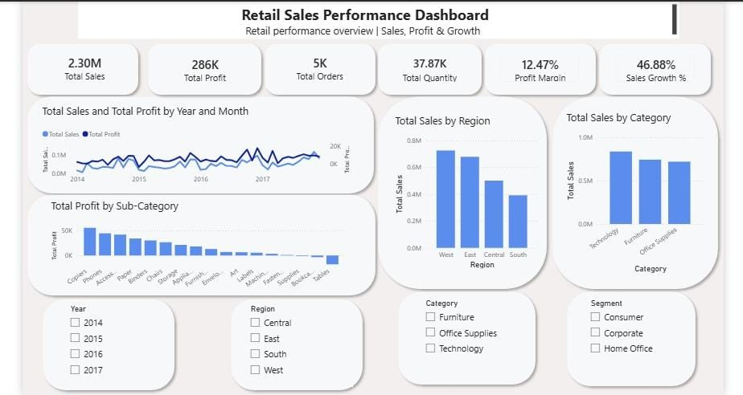

# Retail Sales Data Dashboard

## 📊 Project Overview

An interactive Power BI dashboard designed to analyze retail sales performance and provide insights into sales, profit, orders, quantity, and growth.

The dashboard allows users to interact with the data using filters such as Year, Region, Category, and Segment.

## 🎯 Objectives

- Analyze overall sales and profit performance
- Compare sales across different regions
- Analyze sales by product category
- Identify profitable and less profitable sub-categories
- Track sales and profit trends over time
- Provide an interactive view of retail business performance

## 📈 Key Metrics

- **Total Sales:** 2.30M
- **Total Profit:** 286K
- **Total Orders:** 5K
- **Total Quantity:** 37.87K
- **Profit Margin:** 12.47%
- **Sales Growth:** 46.88%

## 📊 Dashboard Features

- Sales and profit trend analysis
- Regional sales comparison
- Category-wise sales analysis
- Sub-category profit analysis
- Year-wise filtering
- Region filtering
- Category filtering
- Segment filtering

## 🔍 Key Insights

- The **West region** has the highest total sales.
- **Technology** is the leading category by sales.
- **Copiers** generate the highest profit among sub-categories.
- **Tables** show negative profitability and may require further analysis.
- The overall profit margin is **12.47%**.
- Sales growth is **46.88%**, indicating strong sales growth.

## 🛠️ Tools & Technologies

- Power BI
- DAX
- Data Visualization
- Data Analysis

## 📁 Project Files

- `Retail_Sales_Data_Dashboard.pbix` — Power BI dashboard file
- `dashboard-preview.jpeg` — Dashboard preview
- `README.md` — Project documentation